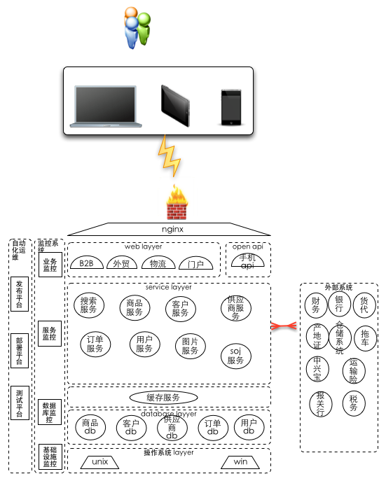
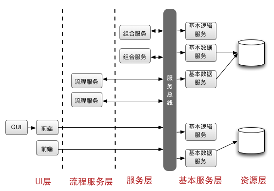
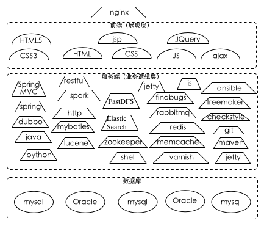
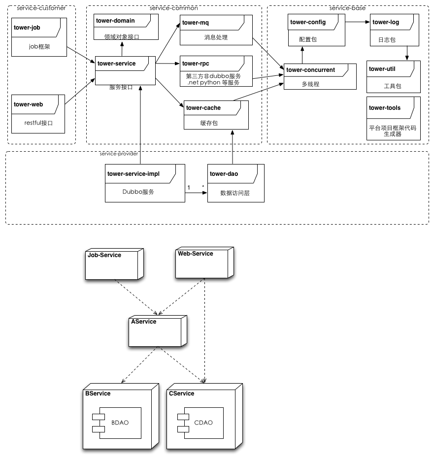

## 架构
### 宗旨
#### 高可用性
+ 自动化运维
	+ 自动化化部署
		+ 统一部署机制
		+ 系统自动化部署
		
	+ 监控平台
		+ 系统基础设施监控
		+ 业务系统监控
		+ 业务数据监控
		
	+ 发布平台
		+ 支持灰度发布
		+ 支持版本快速回滚
		
	+ 自动测试
		+ 自动化测试平台
		+ 单元测试
		
#### 高扩展性
+ 系统架构简单清新
+ 易水平扩展
+ 业务功能能够增加方便

#### 低风险、低成本
+ 提高服务的重用性
+ 提高开发效率
+ 利用成熟的开源技术
+ 启用虚拟化技术

#### 高质量、高效率
+ 重复的事情工具化
+ 复杂的事情简单化
+ 人工的事情系统化
+ 采用敏捷思想指导开发

#### 系统架构图

### 业务架构图
略

### 系统用例图
略

### 技术架构

#### 技术架构图

#### 技术栈

#### 以SOA思想架构系统

##### soa 平台
+ dubbo

## 框架介绍

#### soa服务框架包图

##### tower-framwork
+ 统一的java框架
+ j2ee、spring、mybatis、springmvc、freemarker、memchecache、redis、mysql等

###### tower－util
+ 框架中的公共类，eg：工具类 

###### tower－concurrent
+ 框架中多线程处理模版类
+ 同步锁处理类

###### tower－log
+ 日志处理相关类
+ 每条日志信息都会自动输出当前请求ID(当当前请求没有请求ID时，框架会自动产生)
+ 拦截并且日志输出web服务被调用方的日志（X-Request-ID,ip,ClassName,method,params,time used）
+ 拦截并且日志输出服务调用方及被调用方的日志（X-Request-ID,ip,ClassName,method,params,time used）
+ 数据访问层的每个sql语句的备注部分都会追加请求id

###### tower－config
+ 配置文件存储目录：
	+ 配置目录有三级，安优先级列表如下，序号最小优先级最高
		+ 1,应用配置，位置在应用用安装目录下的config目录
		+ 2,框架默认配置目录,默认在/config，可以通过-Dconfig.file.dir=iiii进行设置调整
		+ 3,classpath:META-INF/config/local/
	+ 配置文件格式支持
		+ xml
		+ properties
	+ 支持动态加载机制［上面1，2项配置支持动态加载］
	+ 相关设计模式：代理设计模式
	+ 相关配置文件：从框架级别进行解耦
	+ 每个配置文件都支持全局级配置及应用级配置
		+ 全局配置规则：不含有'.'符号／或者以'global.'开头
		+ 应用配置规则：应用id（以job Id、serviceId等）开头，用'.'连接配置项；
		+ 资源类型：支持多组机制
			+ database.properties
			+ cache-mem.properties
			+ cache-redis.properties
			+ mq.properties
			+ dubbo.properties
		+ 开关类型：按层管理
			+ acc.xml（数据访问层）
			+ service.xml（service层）
			+ webapp.xml（webapp层）
			+ rpc.xml（rpc层）
			+ job.xml（job层）
###### tower－mq
+ 负责消息中间件通信的模块

###### tower－rpc
+ rpc通信模块（第三方通信）
	+ http
	+ rmi
	+ hessian

###### tower－cache
+ 缓存机制模块
	+ mem cache
	+ redis
	+ 。。。no sql

###### tower－dao
+ 数据访问层框架模块
+ 关系型数据库访问层接口及默认实现机制（mybatis）
+ 数据访问层代码生成器目前支持mysql、sql server
+ 禁止不带where的更新语句执行(全表更新)
+ 开关控制delete语句的执行
+ 支持分表机制：在serviceImpl具体的方法体内使用tabNameSuffix进行分表支持
+ 支持分库机制：在serviceImpl具体的方法体内使用DataSourceRouter进行datasource切换
+ 支持读写分离：改变database.properties数据源xxxx_slave、xxxx_map_query的ip地址

###### tower-domain
+ 业务模型对象模块
	+ DTO 建议其子类实现toString()方法
	+ BO 建议其子类实现toString()方法

###### tower－service
+ service框架模块
+ service服务监控信息采集

###### tower－job
+ job框架模块
+ job监控信息采集
+ 可以动态调整job调度策略
+ 可以通过status=pause的方式动态暂停job的执行（可以控制所有、一组及单独的某一个job）
+ 分页处理job必须继承实现com.tower.service.job.impl.AbsPageableJob,同时必须实现IPageableJob接口
	+ 每页查询timeused及每页处理timeused
	+ 每条处理时间timeused
	+ 错误日志记录
	+ 日志输出totalPage、pageProcessed、totalProcessed、successProcessed、failedProcessed、timeused
+ 循环处理（处理结果影响待处理数据范围）job必须继承实现com.tower.service.job.impl.AbsJob,同时必须实现INormalJob接口
	+ 日志输出total、success、failed、timeused
	+ 每条处理时间timeused
	+ 错误日志记录
+ 应用配置必须放在对应项目的resources/META-INF/config/spring/spring-job.xml中
+ 运行时配置必须放在job.xml
+ 可以通过-DX-Cached=false机制进行查询cache的关闭，或者通过在job.xml中进行配置进行cache关闭,更新时缓存会同步，比如实时性要求较高的job(调用方)，其调用的所有service都不需要启用缓存,默认情况都是启用缓存；

###### tower－web
+ web框架模块
+ web监控信息采集
+ 通过RequestInterceptor
	+ 拦截并读取head参数［X-Request-ID］情况来获取或者产生请求id（X-Request-ID为空时自动产生）,当没有设置时系统会自动产生一个reqid,并且一直往后传，直到db上执行的sql语句；
	+ 拦截并读取head参数［X-Cached］缓存开关参赛，决定是否启用缓存［默认情况下启用缓存］

##### 插件
+ 项目框架生成插件（tower-config-maven-plugin）
+ 测试框架代码生成器插件(tower-test-maven-plugin)
	+ 默认是关闭的,可以通过-Dsoafw.tester.gen=true的方式开启
	+ 不会覆盖原来的实现，可以做到增量实现
	
##### 相关工具
+ 服务项目框架生成器
	+ 项目生成工具
		+ tower-tools
		+ ./gen_all.sh hello company 生成项目的所有模块
		+ ./gen_job.sh hello company xxx 生成特定的job
		+ ./gen_service.sh hello company 生成服务框架
		+ ./gen_web.sh hello company 生成web框架
	+ 数据访问层代码生成器
		+ 支持mysql、sql server
		+ 支持事务（单数据库的两阶段提交分布式事务）
		+ import hello-dao as maven 项目
		+ 在src/test/java中找到com.[company].service.hello.dao.DaoGen
		+ 按照提示修改DaoGen.java内容
		+ 运行DaoGen
	+ service层代码生成器
		+ import hello-service-impl as maven 项目
		+ 在src/test/java中找到com.[company].service.hello.ServiceGen
		+ 按照提示修改ServiceGen.java内容
		+ 运行ServiceGen
	+ 测试框架代码生成器
		+ import hello-service-impl as maven 项目
		+ 运行mvn -Dsoafw.tester.gen=true package，如果已有服务接口设计完成，则可以运行当前命令
		
	+ 代码发布脚步工具 publish目录下
		+ 生成版本号
			+ sh publish.sh hello 
		+ 发布代码到服务器
			+ sh rsyc.sh hello yyyy-MM-dd_xxx targetIp userId

+ exception管理工具
+ checkstyle

##### 相关标准
+ 编程规范
+ 测试规范
+ RESTful
+ dubbo

