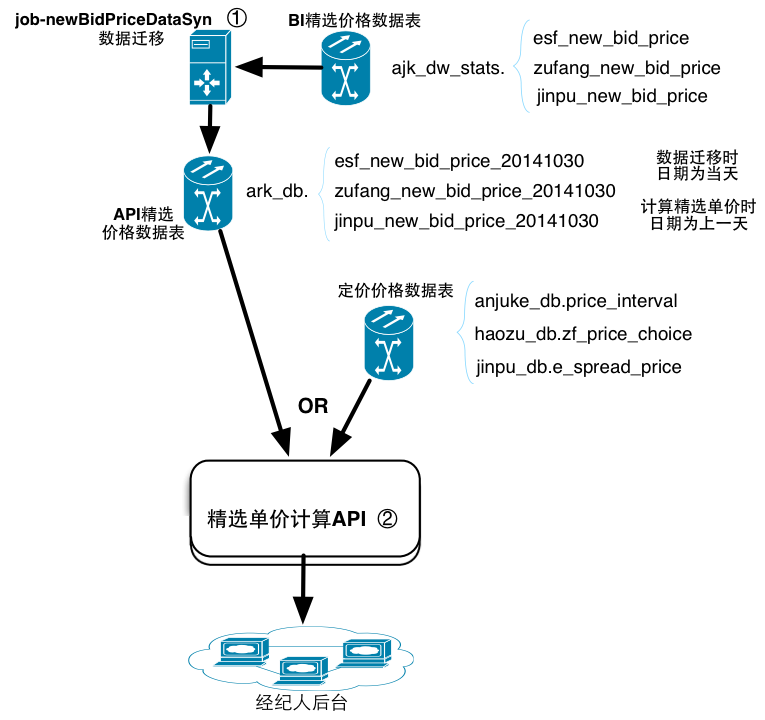
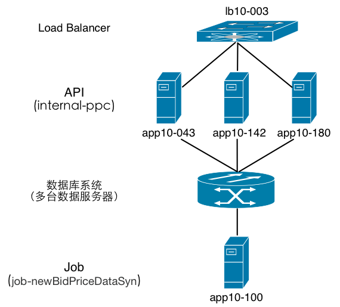

## xxx业务

### 数据流图 [源文件](selectData.graffle)


##### ① job-xxx每天16:00执行，分为三个job，分别处理xx、yy、zz的数据迁移，区别在于启动参数：
+ xx 数据迁移：cd /home/evans/job/job-newBidPriceDataSyn/current/bin; sh run.sh start esf
+ yy  数据迁移：cd /home/evans/job/job-newBidPriceDataSyn/current/bin; sh run.sh start zf
+ zz  数据迁移：cd /home/evans/job/job-newBidPriceDataSyn/current/bin; sh run.sh start jp

##### ② 精选单价计算API

+ [xx 精选单价计算API](ppcTrade-ajkAmountCalc.md)

+ [yy 精选单价计算API](ppcTrade-zfAmountCalc.md)

+ [zz 精选单价计算API](ppcTrade-jpAmountCalc.md)

### 系统部署图 [源文件](selectDeploy.graffle)


### 系统序例图
> 此项主要为描述API
> eg:无

### E-R图
> 此项主要描述关键业务的数据库ER关系图
> eg:无

### 主要状态图
> 此项主要为关键业务的状态图（eg：房源、账务、金融、支付）

### 监控&报警
> 此项是指：是否有相关(业务监控)图表及报警规则；有的话请详细列出。

> eg:无 

### 异常&故障处理机制
> 此项是用来描述系统异常时处理方案

> eg：若是当天的Job没跑或者运行中失败，则清空当天API精选价格数据表，重新启动Job。

比如：2014.11.10日二手房数据迁移job运行失败，则依次执行以下动作：

+ 清空表ark_db.esf_new_bid_price_20141110中的数据
+ 登录到机器app10-100，执行以下命令启动job重新进行数据迁移：

	```
cd /home/evans/job/job-newBidPriceDataSyn/current/bin
sh run.sh start esf
	```


> 此项是指：若有异常或故障出现，可以怎么处理；有的话请详细说明处理步骤。
