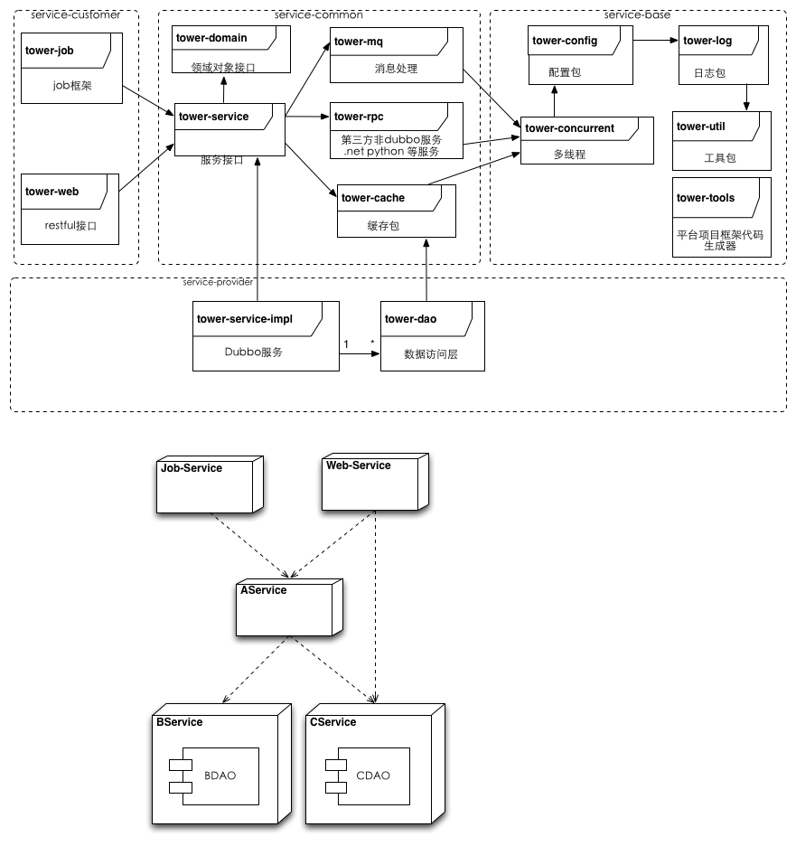

## 框架使用说明

### 搭建本地私服库（nexus）
+ 本地私服库域名
	+ 修改setting.xml，替换repositories中的url的内容为真实maven私服中的public
		+ public url 
	+ 修改tower/pom.xml，替换release url及snapshot url
		+ release url 
		+ snapshot url 
	+ 修改tower-config-maven-plugin/src/main/resources/META-INF/config/template/pom.xml.tpl，替换release url及snapshot url
		+ release url 
		+ snapshot url 

+ 本地开发数据库域名：db.corp.tower.com
	+ 创建soafw_db数据库
	+ 修改tower-config/src/main/resource/META-INF/tower.properties内的数据库配置信息
+ 备注：个别java包可能需要在互联网上单独下载，公共的私服服务上可能没有；
	+ dubbo 2.8.4.jar [dubbox]
	+ memcached-2.0.1.jar
+ 配置maven配置文件settings.xml
<p>详细配置信息</p>

```
<?xml version="1.0" encoding="UTF-8"?>
<settings xmlns="http://maven.apache.org/SETTINGS/1.0.0"
	xmlns:xsi="http://www.w3.org/2001/XMLSchema-instance"
	xsi:schemaLocation="http://maven.apache.org/SETTINGS/1.0.0 http://maven.apache.org/xsd/settings-1.0.0.xsd">
	<!-- <localRepository>D:\.m2\repository</localRepository> -->

	<pluginGroups>
		<pluginGroup>com.tower.soafw</pluginGroup>
	</pluginGroups>

	<proxies>
	</proxies>

	<servers>
		<server>
			<id>nexus-releases</id>
			<username>admin</username>
			<password>admin123</password>
		</server>
		<server>
			<id>nexus-snapshots</id>
			<username>admin</username>
			<password>admin123</password>
		</server>
		<server>
			<id>deploymentRepo</id>
			<username>admin</username>
			<password>admin123</password>
		</server>
	</servers>

	<mirrors>
		<mirror>
			<id>UK</id>
			<name>UK Center</name>
			<url>http://uk.maven.org/maven2</url>
			<mirrorOf>central</mirrorOf>
		</mirror>
		<mirror>
			<id>US Central</id>
			<name>US Center</name>
			<url>http://repo1.maven.org/maven2</url>
			<mirrorOf>central</mirrorOf>
		</mirror>
		<mirror>
			<id>maven2</id>
			<name>maven2 Center</name>
			<url>http://central.maven.org/maven2</url>
			<mirrorOf>central</mirrorOf>
		</mirror>
	</mirrors>

	<profiles>
		<profile>
				<id>jdk-1.7</id>
				<activation>
				<activeByDefault>true</activeByDefault>
					<jdk>1.7</jdk>
				</activation>
				<properties>
					<maven.compiler.source>1.7</maven.compiler.source>
					<maven.compiler.target>1.7</maven.compiler.target>
					<maven.compiler.compilerVersion>1.7</maven.compiler.compilerVersion>
				</properties>
			</profile>
		<profile>
			<id>nexus</id>
			<repositories>
				<repository>
					<id>central</id>
					<name>central</name>
					<url>http://mvn.leya.com/content/repositories/central/</url>
					<releases>
							<enabled>true</enabled>
					</releases>
					<snapshots>
							<enabled>true</enabled>
					</snapshots>
				</repository>
				<repository>
					<id>releases</id>
					<name>releases</name>
					<url>http://mvn.leya.com/content/repositories/releases</url>
					<releases>
							<enabled>true</enabled>
					</releases>
					<snapshots>
							<enabled>true</enabled>
					</snapshots>
				</repository>
				<repository>
					<id>public</id>
					<name>public</name>
					<url>http://mvn.leya.com/content/groups/public/</url>
					<releases>
						<enabled>true</enabled>
					</releases>
					<snapshots>
						<enabled>true</enabled>
					</snapshots>
				</repository>
				<repository>
					<id>thirdparty</id>
					<name>thirdparty</name>
					<url>http://mvn.leya.com/content/repositories/thirdparty/</url>
					<releases>
							<enabled>true</enabled>
					</releases>
					<snapshots>
							<enabled>true</enabled>
					</snapshots>
				</repository>
				<repository>
					<id>snapshots</id>
					<name>snapshots</name>
					<url>http://mvn.leya.com/content/repositories/snapshots/</url>
					<releases>
							<enabled>true</enabled>
					</releases>
					<snapshots>
							<enabled>true</enabled>
					</snapshots>
				</repository>
			</repositories>
			<pluginRepositories>
				<pluginRepository>
					<id>nexus</id>
					<name>Nexus</name>
					<url>http://mvn.leya.com/content/groups/public/</url>
					<releases>
						<enabled>true</enabled>
					</releases>
					<snapshots>
						<enabled>true</enabled>
					</snapshots>
				</pluginRepository>
				<pluginRepository>
					<id>thirdparty</id>
					<name>thirdparty</name>
					<url>http://mvn.leya.com/content/repositories/thirdparty/</url>
					<releases>
							<enabled>true</enabled>
					</releases>
					<snapshots>
							<enabled>true</enabled>
					</snapshots>
				</pluginRepository>
			</pluginRepositories>
		</profile>
	</profiles>
	<activeProfiles>
		<activeProfile>nexus</activeProfile>
	</activeProfiles>
</settings>
```

### 安装Jenkins（构件）

+ 安装jenkins	
	+ 安装gitlab插件
	+ 创建gitlab用户
	+ 安装ssh key
	+ 安装maven插件
	+ 系统管理->系统配置
		+ 主目录配置：/root/.jenkins
		+ 工作空间根目录:
			+ 登录到部署机器
			+ mkdir -p /root/code/projects/workspace
			+ /root/code/projects/workspace/${ITEM_FULL_NAME}
		+ 构建记录根目录:
			+ ${ITEM_ROOTDIR}/builds/${ITEM_FULL_NAME}
			

## 框架介绍

### soa服务框架包图



### tower-framwork

+ 统一的java框架
+ j2ee、spring、mybatis、springmvc、freemarker、memchecache、redis、mysql等

### tower－util

+ 框架中的公共类，eg：工具类 

### tower－concurrent

+ 框架中多线程处理模版类
+ 同步锁处理类

### tower－log

+ 日志处理相关类
+ 每条日志信息都会自动输出当前请求ID(当当前请求没有请求ID时，框架会自动产生，并且一直跟着到最后：追加到sql语句的备注部分)

### tower－config

+ 配置文件存储目录：
	+ 配置目录有三级，安优先级列表如下，序号最小优先级最高
		+ 0,全局配置，存储在zookeeper中
		+ 1,应用配置，位置在应用用安装目录下的config目录
		+ 2,框架默认配置,默认在/config，可以通过-Dconfig.file.dir=iiii进		行设置调整
		+ 3,本地开发配置：classpath:META-INF/config/local/
	+ 配置文件格式支持
		+ xml
		+ properties
	+ 支持动态加载机制［上面1，2项配置支持动态加载］
	+ 相关设计模式：代理设计模式
	+ 相关配置文件：从框架级别进行解耦
	+ 每个配置文件都支持全局级配置及应用级配置
		+ 全局配置规则：不含有'.'符号／或者以'global.'开头
		+ 应用配置规则：应用id（以job Id、serviceId等）开头，用'.'连接配置项；
		+ 资源类型：支持多组机制
			+ database.properties
			+ cache-mem.properties
			+ cache-redis.properties
			+ mq.properties
			+ dubbo.properties
		+ 开关类型：按层管理
			+ acc.xml（数据访问层）
			+ service.xml（service层）
			+ webapp.xml（webapp层）
			+ rpc.xml（rpc层）
			+ job.xml（job层）
### tower－mq

+ 负责消息中间件通信的模块

### tower－rpc

+ rpc通信模块（第三方通信）
	+ http
	+ rmi
	+ hessian

### tower－cache

+ 缓存机制模块
	+ mem cache
	+ redis
	+ 。。。no sql

### tower－dao

+ 数据访问层框架模块
+ 关系型数据库访问层接口及默认实现机制（mybatis）
+ 数据访问层代码生成器目前支持mysql、sql server

### tower－model

+ 业务模型对象模块
	+ DTO 建议其子类实现toString()方法
	+ BO 建议其子类实现toString()方法

### tower－service

+ service框架模块
+ service服务监控信息采集

### tower－job

+ job框架模块
+ job监控信息采集
+ 可以动态调整job调度策略
+ 可以通过status=pause的方式动态暂停job的执行（可以控制所有、一组及单独的某一个job）

### tower－web

+ web框架模块
+ web监控信息采集
+ 通过RequestInterceptor
	+ 拦截并读取head参数［X-Request-ID］情况来获取或者产生请求id（X-Request-ID为空时自动产生）,当没有设置时系统会自动产生一个reqid,并且一直往后传，直到db上执行的sql语句；
	+ 拦截并读取head参数［X-Cached］缓存开关参赛，决定是否启用缓存［默认情况下启用缓存］

+ 插件
	+ 项目框架生成插件（tower-config-maven-plugin）
	+ 测试框架代码生成器插件(tower-test-maven-plugin)
		+ 默认是关闭的,可以通过-Dsoafw.tester.gen=true的方式开启
### 相关工具

+ 服务项目框架生成器
	+ 项目生成工具
		+ tower-tools
		+ ./gen_all.sh hello company 生成项目的所有模块
		+ ./gen_job.sh hello company xxx 生成特定的job
		+ ./gen_service.sh hello company 生成服务框架
		+ ./gen_web.sh hello company 生成web框架
	+ 数据访问层代码生成器
		+ 支持mysql、sql server
		+ 支持事务（单数据库的两阶段提交分布式事务）
		+ import hello-dao as maven 项目
		+ 在src/test/java中找到com.[company].service.[项目名称].dao.DaoGen
		+ 按照提示修改DaoGen.java内容
		+ 运行DaoGen.java
	+ service代码生成器
		+ 运行项目src/test/java中找到com.[company].service.[项目名称]/ServiceGen.java
		+ 按照提示修改ServiceGen.java内容
		+ 运行ServiceGen.java
	+ 代码发布脚步工具 publish目录下
		+ 生成版本号
			+ 修改 publish.sh 内的source_base、release_base
			+ sh publish.sh hello 分支名
		+ 发布代码到服务器
			+ 在远程targetIp上创建用户userId
			+ 修改 rsyc.sh 内的release_base,并且创建release_base
			+ sh rsyc.sh hello 分支名 yyyy-MM-dd_xxx targetIp userId
		+ 运行程序
			+ ssh userId@targetIp #登录到远程机器
			+ cd $release_base/$app/$branch/current
			+ sh ./startService.sh #启动service:
			+ sh ./startWeb.sh #启动web
			+ sh ./start-job.sh #启动job
+ exception管理工具
+ checkstyle

### 相关标准

+ 编程规范
+ 测试规范
+ RESTful
+ dubbo

### deploy

+ mvn deploy

### 安装git

```
开通域名:gitlab.corp.tower.com
一键安装 gitlab7 on rhel6.4 并设置邮件发送

世间本无事，庸人自扰之。书归正传，简短节说：gitlab是个好东西，但是安装手册奇烂。虽然曾经对照文档一步一步安装起来gitlab 6.x，但是，时过境迁，再也不想把时间花在这无聊的配置上。谷歌已然变成往日黄花，又无翻越 墙 狱之利器，只能在百度和Bing之间来回寻找答案。


功夫不负苦心人。终于找到这个bitnami的一键安装包。bitnami-gitlab-7.1.1-0-linux-x64-installer.run。


https://bitnami.com/redirect/to/39039/bitnami-gitlab-7.1.1-0-linux-x64-installer.run
```

1 安装全过程

```
[root@rhel64-origin ~]# service mysqld stop
Stopping mysqld:                                           [  OK  ]
[root@rhel64-origin ~]# ./bitnami-gitlab-7.1.1-0-linux-x64-installer.run
The installer detects that exists a 'git' user in the system. This installer will change the config                        uration for this user. Do you want to continue the installation? [y/N]: y

The installer detects that exists a 'gitlab_ci' user in the system. This installer will change the                         configuration for this user. Do you want to continue the installation? [y/N]: y

----------------------------------------------------------------------------
Welcome to the Bitnami Gitlab Stack Setup Wizard.

----------------------------------------------------------------------------
Select the components you want to install; clear the components you do not want
to install. Click Next when you are ready to continue.

GitLab : Y (Cannot be edited)

GitLab CI [Y/n] :Y

Is the selection above correct? [Y/n]: Y

----------------------------------------------------------------------------
Installation folder

Please, choose a folder to install Bitnami Gitlab Stack

Select a folder [/opt/gitlab-7.1.1-0]:

----------------------------------------------------------------------------
Create Admin account

Bitnami Gitlab Stack admin user creation

Email Address [user@example.com]: 3501xxxxx@qq.com

Login [user]: master

Password :********
Please confirm your password :********
----------------------------------------------------------------------------
Hostname that will be used to create internal URLs. If this value is incorrect,
you may be unable to access your Gitlab installation from other computers. It is
advisable to use a Domain instead of an IP address for compatibility with
different browsers.

Domain [192.168.82.181]:gitlab.corp.tower.com

Do you want to configure mail support? [y/N]: y

----------------------------------------------------------------------------
Configure SMTP Settings

This is required so your application can send notifications via email.

Default email provider:

[1] GMail
[2] Custom
Please choose an option [1] : 2

----------------------------------------------------------------------------
Configure SMTP Settings

This data is stored in the application configuration files and may be visible to
others. For this reason, it is recommended that you do not use your personal
account credentials.

Username []: 3501xxxxx@qq.com

Password :
Re-enter :
SMTP Host []: smtp.qq.com

SMTP Port []: 25

Secure connection

[1] None
[2] SSL
[3] TLS
Please choose an option [3] :3

----------------------------------------------------------------------------
Setup is now ready to begin installing Bitnami Gitlab Stack on your computer.

Do you want to continue? [Y/n]: y

----------------------------------------------------------------------------
Please wait while Setup installs Bitnami Gitlab Stack on your computer.

 Installing
 0% ______________ 50% ______________ 100%
 ###############################

----------------------------------------------------------------------------
Setup has finished installing Bitnami Gitlab Stack on your computer.

Info: To access the Bitnami Gitlab Stack, go to
http://192.168.82.181:80 from your browser.
Press [Enter] to continue:
```
2 更改配置以发送邮件

重要！此时还不能发送邮件。需要更改几个配置：

1） config/environments/production.rb

```
# vi /opt/gitlab-7.1.1-0/apps/gitlab/htdocs/config/environments/production.rb
  ........
  # config.action_mailer.delivery_method = :sendmail
  # Defaults to:
  # # config.action_mailer.sendmail_settings = {
  # #   location: '/usr/sbin/sendmail',
  # #   arguments: '-i -t'
  # # }
  config.action_mailer.perform_deliveries = true
  config.action_mailer.raise_delivery_errors = true
  config.action_mailer.delivery_method = :smtp
  config.action_mailer.smtp_settings = {
    :address => "smtp.qq.com",
    :port => "25",
    :domain => "smtp.qq.com",
    :authentication => :plain,
    :user_name => "3501xxxxx@qq.com",
    :password => "********",
    :enable_starttls_auto => true
  }
  ........
  ```
2） config/environments/production.rb

```
# cd /opt/gitlab-7.1.1-0/apps/gitlab/htdocs/config/initializers/
  # cp smtp_settings.rb.sample smtp_settings.rb
  # vi smtp_settings.rb
内容如下：
# To enable smtp email delivery for your GitLab instance do next:
# 1. Rename this file to smtp_settings.rb
# 2. Edit settings inside this file
# 3. Restart GitLab instance
#
if Rails.env.production?
  Gitlab::Application.config.action_mailer.delivery_method = :smtp

  ActionMailer::Base.smtp_settings = {
    address: "smtp.qq.com",
    port: 25,
    user_name: "3501xxxxx@qq.com",
    password: "********",
    domain: "qq.com",
    authentication: :login,
    enable_starttls_auto: true
  }
end

```
3） config/gitlab.yml

```
# # # # # # # # # # # # # # # # # #
# GitLab application config file  #
# # # # # # # # # # # # # # # # # #
#
# How to use:
# 1. copy file as gitlab.yml
# 2. Replace gitlab -> host with your domain
# 3. Replace gitlab -> email_from

production: &base
  #
  # 1. GitLab app settings
  # ==========================

  ## GitLab settings
  gitlab:
  ## Web server settings (note: host is the FQDN, do not include http://)
  host: 192.168.82.181
  port: 80
  https: false

  # Uncommment this line below if your ssh host is different from HTTP/HTTPS one
  # (you'd obviously need to replace ssh.host_example.com with your own host).
  # Otherwise, ssh host will be set to the `host:` value above
  # ssh_host: ssh.host_example.com

  # WARNING: See config/application.rb under "Relative url support" for the list of
  # other files that need to be changed for relative url support
  # relative_url_root: /gitlab

  # Uncomment and customize if you can't use the default user to run GitLab (default: 'git')
  # user: git

  ## Email settings
  # Email address used in the "From" field in mails sent by GitLab
  email_from: 3501xxxxx@qq.com
  support_email: 3501xxxxx@qq.com

  # Email server smtp settings are in [a separate file](initializers/smtp_settings.rb.sample).
........
```
3 启动服务并访问

```
# /opt/gitlab-7.1.1-0/ctlscript.sh restart

此时创建用户，就会发送邮件了。

别忘记 qq邮箱中打开下面的服务：

以上在RHEL6.4上经过严格测试。
```
